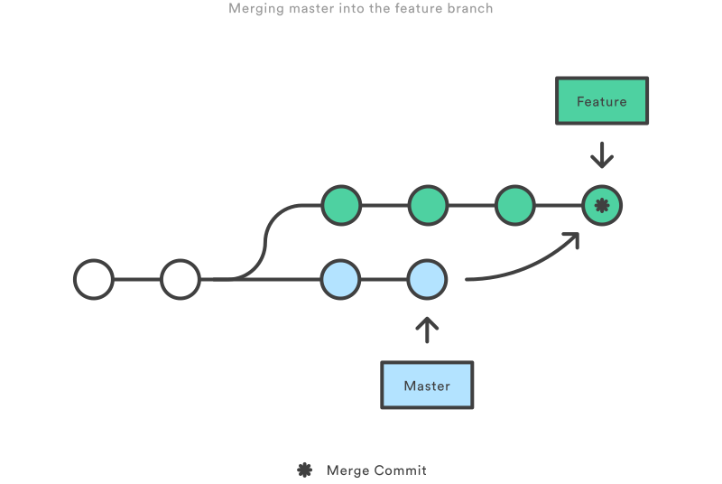
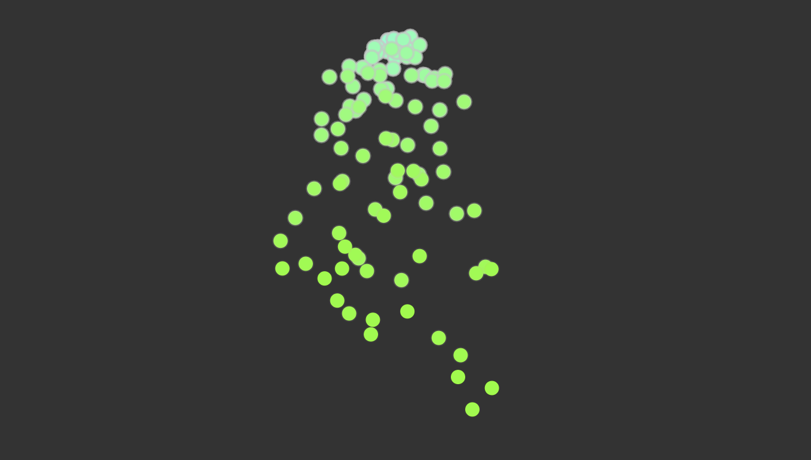
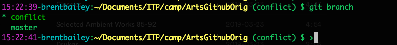
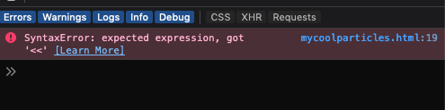
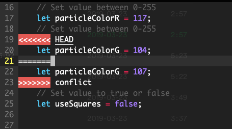

# Branching!

#### Now we're gonna take some time and talk about why Git isn't just great for keeping copies of your files, but also iterating and experiemnting

Using branches allows you to maintain multiple different timelines of your git repository, essentially turning you into a time traveler



As you can see in this image, when you "branch" you're taking the state of the repository in the current time, and copying it into a new “branch”: creating a new version of the repo which can be safely changed without affecting the original repository.

Let's look at this file I've included to see what the base looks like.



You can open this file yourself by going to

```
file:///Users/myname/{path_to_repo}/githubforartistsitpcamp/branching/mycoolparticles.html
```

Now, let’s create our first branch

```
git checkout -b 'prettify'
```

Cool, let’s reload the page! We should see the same thing.

#### Making Changes

Okay now that we have our branch, let’s make some changes. Open the file "mycoolparticles.html" in the text editor of your choice.

* In this file, we’ll change some variables that will alter the behavior of the particle system.

```buildoutcfg
        // CHANGE THESE PARAMETERS

        // Set value between 0-255
        let particleLifespan = 100;
        // Set value between 0-255
        let particleColorR = 127;
        // Set value between 0-255
        let particleColorG = 255;
        // Set value to true or false
        let useSquares = false;
```

Oh wow, that looks great.  Now, let’s create a new commit!

```buildoutcfg
git add branching/mycoolparticles.html
git commit -m 'made things look GOOD'
git log

```

We can now see that the HEAD is set to our **prettify** branch.  Let’s checkout the master branch again to make sure things haven't changed.

```buildoutcfg
git checkout master
```

Now let’s open our page and see what happens. Looks good, right?

We can switch back to the prettify branch and keep making changes, or we can decide that we want to take the changes we made on our branch and make those the new master version for the repo. We can do that with a simple command

```buildoutcfg
Matts-MacBook-Pro:GithubForArtistsITPCamp mattross$ git merge prettify
Updating 7271a8a..6f4bcfe
Fast-forward
 branching/mycoolparticles.html | 4 ++--
 1 file changed, 2 insertions(+), 2 deletions(-)
```

Now, if we look at the webpage you should see our new changes!


#### Hard mode: merge conflicts

Now that we know how to branch and merge, it’s time to introduce a little complexity to the system. In the world of git, things rarely go as smoothly as this example does. You’ll often find, when collaborating with other people (or even just iterating on your own), that even with this beautiful system designed to keep our work isolated and prevent us from messing up, mistakes are made.

There are more complex ways this can happen that we won’t address here, but the thing you’re most likely to run into is a *merge conflict*: this happens when two branches are working on the same file and each commits a change to that file before they’re up to date with one another.

If this doesn’t make sense, don’t worry. We’re going to make a merge conflict happen, and figure out how to fix it.

Following the same steps as above, let’s create a new branch: we’ll call it `conflict`.

Enter `git checkout -b ‘conflict’` into the command line.



If we enter `git branch` into the command line, we should see that the conflict branch has been created and is currently selected (if you want to have the curent git branch simply show up in your command line prompt like mine does, you can follow the instructions [here](https://gist.github.com/joseluisq/1e96c54fa4e1e5647940)).

In the text editor of your choice, make a change to the mycoolparticles.html file.  I’m going to change the value of the particle color:

        ```let particleColorG = 107;```

Now let’s add and commit this change:

` git add .`

` git commit -am “changed particle color.”`

Now, we’re going to switch to the master branch and do the same thing, setting a different value for particle color.

`git checkout master`

I’m going to change the color to 104.

`let particleColorG = 104`

Now, same as above, save the file, and then let’s add and commit our changes.

`git add .`

`git commit -am ‘changed particle color, but differently’`

Now that we’ve done this, let’s try to merge our branches!

In the command line, enter `git merge conflict`. You should see something like this:


If we open the html file, nothing will happen, and upon inspecting we’ll see something like this:


What happened? Both branches have changed to a different particle color since we created the conflict branch, and neither knows which one is supposed to be right. If you open `mycoolparticles.html` and go to the `particleColorG` variable, you should see something like this:



This may seem intimidating, but it’s actually quite simple: the values betwen the `<<<<<<<< HEAD` and the `=======` are the values on the current branch (`master`), and the values after  the `=========` and before the `>>>>>>>> conflict` are the values on the branch we’re trying to merge in.Basically, “HEAD” means current branch, and the other value is named for the branch we’re merging.

Pick which one you’d like to keep, then delete the other, making sure to delete the `<<<<<<<< HEAD`, `==========`, and `>>>>>>>> conflict` as well.

Save the file, then add and commit these changes: `git add .`, followed by `git commit -am ‘fix merge conflicts`.

If you open the file in your browser, it should now be working fine.


Example adapted from
https://p5js.org/examples/simulate-particle-system.html
