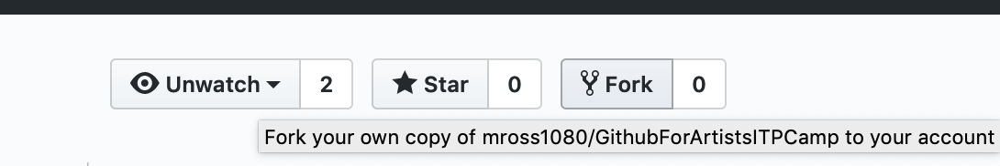
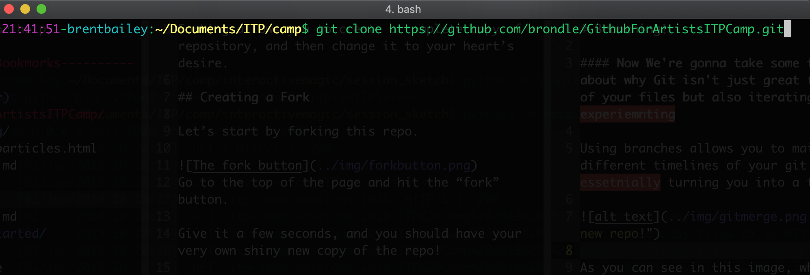
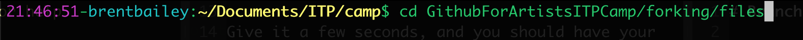
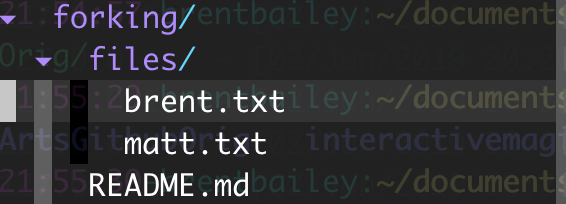
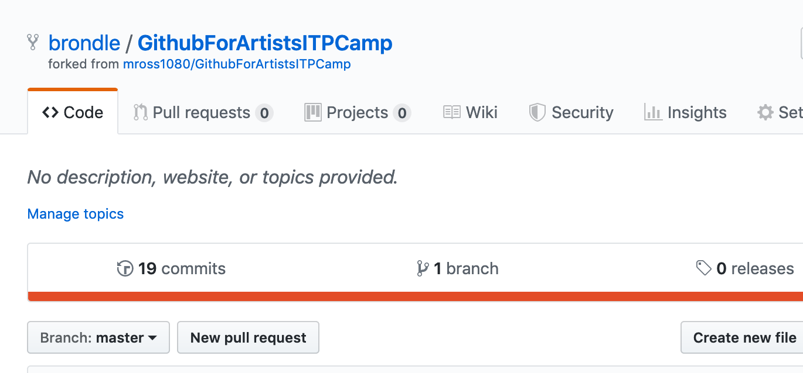
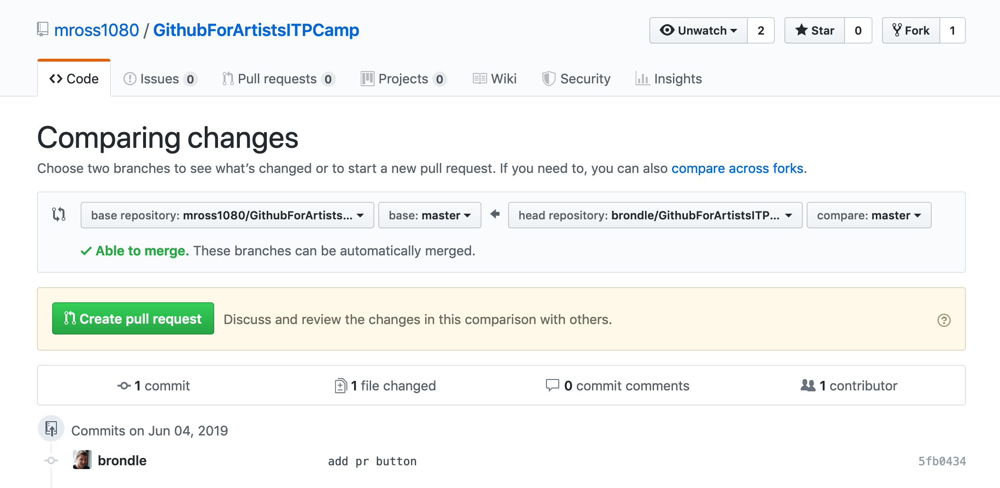
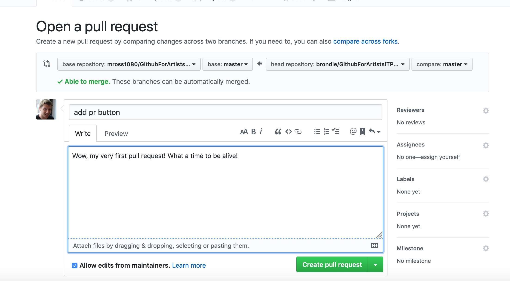
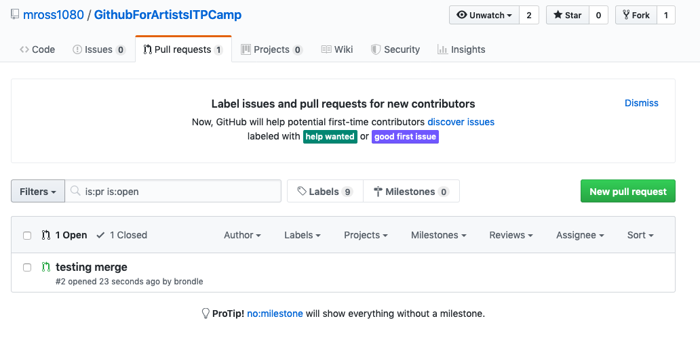
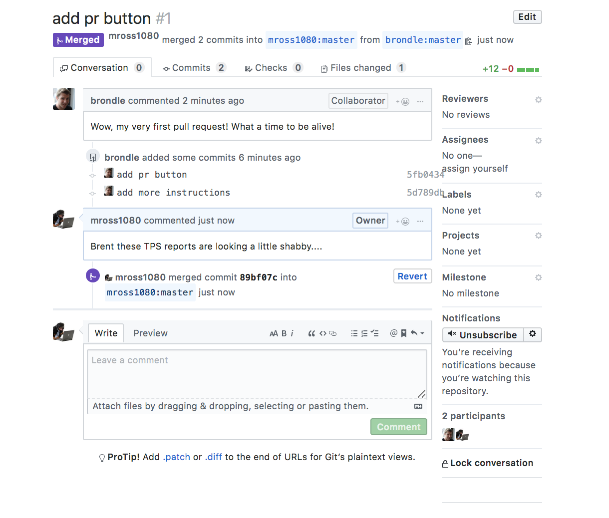
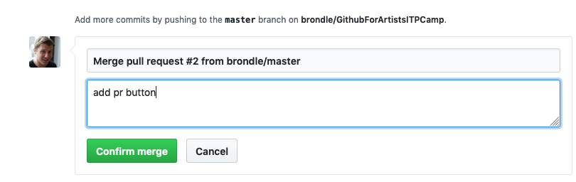

# Forking!

Now we’re getting into forking.

Forking allows you to create a complete copy of a repository, and then change it to your heart’s desire.

## Creating a Fork

Let’s start by forking this repo. For this exercise we’re going to pair up and take turns following the steps.

### 1. Select one of the partners, then have that partner go to the top of this page and hit the “fork” button.

Give it a few seconds, and you should have your very own shiny new copy of the repo!

### 2. Once this fork is loaded, the partner who *did not create a fork in the first step* will create their own fork - but this one is a fork of *their partner’s fork* (we call this forkception).

On your own computer, navigate to the URL of your partner’s fork and follow the same instructions they followed in step 1.

### 3. Once it’s loaded, both partners will create a “clone” of their forked repository on their local system.

Go to the bright green “Clone or Download” button, click it, and copy the link shown to the clipboard.

## Cloning your fork

Now let’s go back to the terminal.

In your command line prompt (making sure to enter the folder you want this repository to be in, using `cd TheDirectoryIWant`), enter
`git clone `, paste the link we copied to our clipboard, and hit enter. Congrats! You should have successfully cloned this repository.

## Adding and changing files

 1. Once your clone is set up with the fork as a remote, enter `cd forking/files` in the command line.
You’re now in the “files” directory of the “forking” subdirectory.

 2. Now enter `touch yourname.txt` in the command line, substituting your actual name for yourname.

 3. Using your favorite text editor, open the “yourname.txt” file and add your favorite food (or whatever you feel like adding) into the file. Save it.

 4. Return to the terminal and enter `git add .` then `git commit -am “add favorite food file”`.

## Pushing and Creating A Pull Request

Both partners should now push to origin: enter `git push origin master` in the command line.

The partner who forked second can now add the partner who forked first’s repo as a remote: go to their repo in the browser, copy the same URL you used to clone the repo, and then in the terminal type: `git remote add yourpartnersname ` then copy the URL and hit enter.

You can now pull from our partner’s repository: `git pull yourpartnersname master`.

If we check in our file system, you should now see both your name and theirs.

#### Now for the fun part:

Now that you’ve added their changes, push to your fork again: `git push origin master`. In the browser, navigate to your fork.

### 1. Hit the “New pull request” button on the lower left.

### 2. On the following page, if you see a green checkmark that says “Able to merge”, hit the “Create pull request” button.

One last page to go! Traditionally you can enter comments here if you have any questions or feel that your commit requires more explanation than you could fit in the commit message.

### 3. Once you feel like you’re ready to go, hit “Create pull request”

Congrats! You just created your first pull request.

## Merging a pull request

Now, the person who’s fork was pull requested can merge the pull request.

1. In GitHub, navigate to the “Pull requests” tab.

You should see one pull request listed as “open”. Click on it.

2. If everything went right, you should see a message that the branch has no conflicts with the base branch, and a green button that says “Merge pull request.” Click it (or comment on the pull request if you’re unsatisfied for any reason.)

3. Now, hit “Confirm merge”.

Congrats! You’ve successfully completed the workflow that just about every open source project you’ll ever encounter uses.
