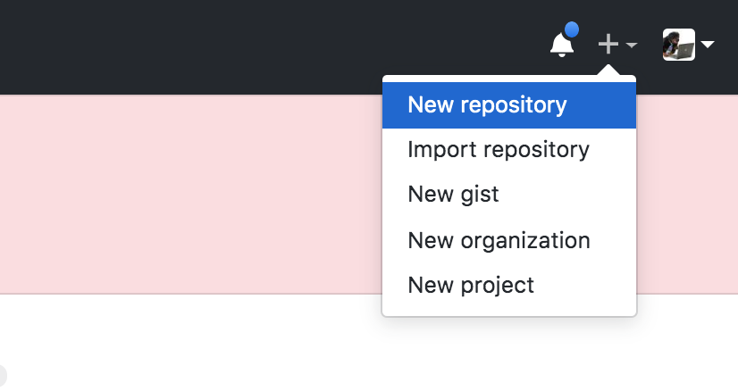
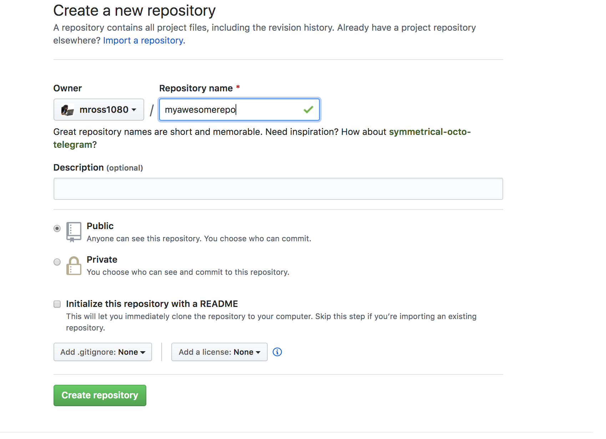
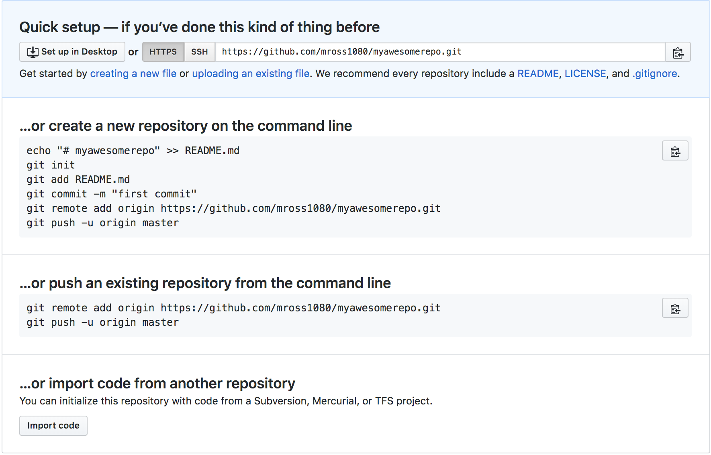
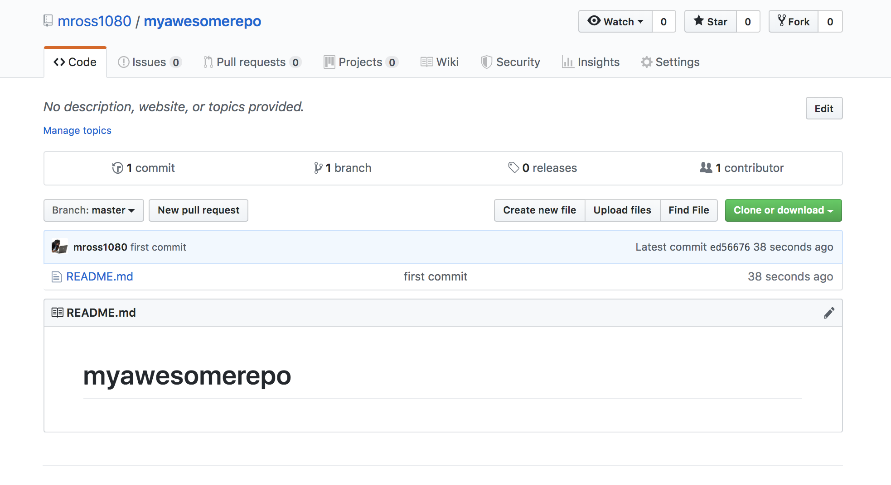

# Getting Started!


Here are the main commands you'll be working with

```
git status
git add {my file}
git commit -m 'commit message'
git push {repo origin} {branch of repository to push to}
```

* When I am done working on a file I "add" it
    * When you add a file, you "stage" it. This means git is now tracking that file and any changes you make to it.

* Then I "commit" it
    * When you commit a file you are saving the changes you made in that file with a specific index inside git: it will store these changes in its log of commits, which you can see anytime by typing `git log` into the command line. Committing regularly ensures that you have an easy-to-follow list of changes (and you can undo or remove commits without seriously damaging your codebase).

    * These changes are all stored locally, on your computer.
* Then I "push" it
    * Upload those changes to the remote repository. This will keep the changes stored in GitHub. You should push after every commit - this way, if your computer dies or something goes terribly wrong, your work will still be stored online.


#### Add.....Commit....Push....

#### Remote Repository?


Github may be the topic of today’s session but it all works through the git protocol.
A remote repository is just a copy of your work stored in a different place then where you are currently working.


## Steps


### 1. Create your own repo.



### 2. Give it a name!


### 3. Follow the instructions


In terminal, you can either manually initiate git and add this GitHub repo as a remote, following the first steps shown here, or you can simply go to the folder of your choice, copy the link at the top of the page, and enter git clone `your repo’s URL`. For this example, we’ll be following the “create a new repository on the command line” steps.

### 4. Go look at your new repo!



## Challenge!
* Add your favorite quote  and push it to github!

Remember the steps! On your local computer, go to this folder change the file README make a change, then return to the terminal.

```
git status
git add README.md
git commit -m 'changed some stuff'
git push origin master
```
